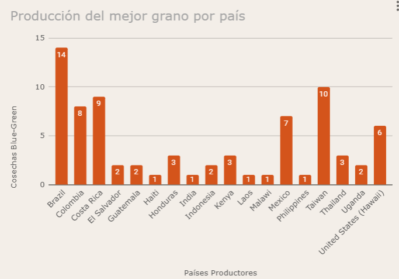
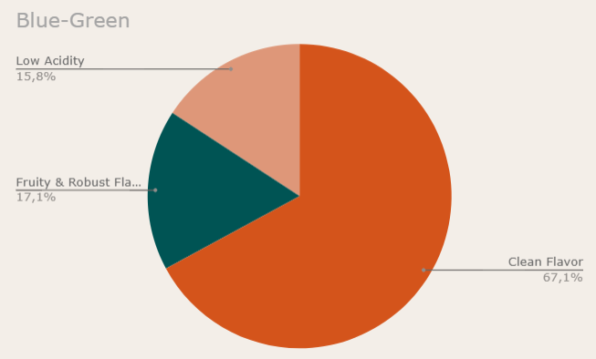

# Práctica para prueba técnica

Se trabajarán con los datos de: 

* [Repositorio de Kaggle](https://www.kaggle.com/datasets/volpatto/coffee-quality-database-from-cqi)

## Encabezado de datos:

* Species: Categoría general de la especie del café
* Owner: Propietario del café o la finca
* Country.of.Origin: País de origen del café
* Farm.Name: Nombre de la granja/finca
* Lot.Number: Número de lote del café 
* Mill: Molino/procesador utilizado
* ICO.Number: número de lote de exportación asignado por la Organización Internacional del Café (International Coffee Organization, ICO)
* Company: Nombre de la compañía asociada con el café
* Altitude: altura sobre el nivel del mar a la que se cultiva el café
* Region: Región específica de cultivo del café
* Producer: Productor o cultivador del café
* Number.of.Bags: Número de bolsas de café
* Bag.Weight: Peso de la bolsa de café, en kilogramos
* In.Country.Partner: Socio en el país de origen
* Harvest.Year: Año de cosecha del café
* Grading.Date: Fecha de clasificación del café
* Owner.1: Identificador único del propietario
* Variety: Variedad específica de la especie de café
* Processing.Method: Método de procesamiento del café (ej. lavado, natural)
* Aroma: Descripción del aroma del café
* Flavor: Descripción del sabor del café
* Aftertaste: Sabor residual del café después de ser ingerido
* Acidity: Nivel de acidez del café
* Body: Sensación del cuerpo del café en la boca
* Balance: Equilibrio de los diferentes sabores en el café
* Uniformity: Uniformidad del café en términos de sabor y calidad
* Clean.Cup: Limpieza del sabor del café
* Sweetness: Nivel de dulzura del café
* Cupper.Points: Puntaje asignado por el catador
* Total.Cup.Points: Puntaje total de la cata del café
* Moisture: Contenido de humedad del café
* Category.One.Defects: Defectos de primera categoría encontrados en el café
* Quakers: Granos de café que no se han desarrollado adecuadamente
* Color: Color del grano de café
* Category.Two.Defects: Defectos de segunda categoría encontrados en el café
* Expiration: Fecha de caducidad del café
* Certification.Body: Organismo certificador del café
* Certification.Address: Dirección del organismo certificador
* Certification.Contact: Contacto del organismo certificador
* unit_of_measurement: Unidad de medida utilizada para las altitudes
* altitude_low_meters: Altitud mínima de cultivo, en metros
* altitude_high_meters: Altitud máxima de cultivo, en metros
* altitude_mean_meters: Altitud media de cultivo, en metros

## Documento Google Sheets

[Enlace](https://docs.google.com/spreadsheets/d/115NV9xmySNbfob0UTHD5P6ybP531KJRwMP8MhhMR6I8/edit?usp=sharing)

## Verdades establecidas

* Humedad aceptada para considerar apto el café: de 8% a 12%
* Total.Cup.Points es la sumatoria de los valores en los campos: Aroma, Flavor, Aftertaste, Acidity, Body, Balance, Uniformity, Clean.Cup, Sweetness, Cupper.Points
* Partiendo de los métodos de procesamiento de café en el data set, se establece como uso común según tipo de procesamiento lo siguiente:
  * Natural / Dry: Fruity & Robust Flavor 
  * Pulped Natural / Honey: Balanced Flavor and Acidity 
  * Semi-washed / Semi-pulped: Low Acidity 
  * Washed / Wet: Clean Flavor 
  * Vacío: Other
  * Other: Other 
* Orden calificativo del café empezando por el mejor calificado:
  * Blue-Green (este es el color más deseado y se asocia con granos de alta calidad y frescura)
  * Bluish-Green
   * Green (este es el color más básico y puede indicar granos de menor calidad)
 * Category.One.Defects: se establece que se trabaja con una muestra de 100gr
 * Category.Two.Defects: se establece que se trabaja con una muestra de 300gr

## Preguntas planteadas con los datos

1. ¿Cuáles países producen el grano de mejor color?
   1. ¿Qué tipo de molino usan?
2. Top 3 países con productores de bolsas de café más pesadas
3. Top 3 países con granos en humedad ideal
4. Top 3 fincas con mejor Total.Cup.Points donde el café en Category.Two.Defects está sin defectos
5. Relación peso-calidad, grano-Total.Cup.Points
6. Distancia en tiempo entre cosecha y vencimiento
7. Relación altitud - calidad del grano
   
   Alertas:
   1. Fincas con producción de café no idóneo
   2. Top 3 fincas con granos más defectuosos
   3. Top 5 fincas que se vence muy rápido el café

## Tratamiento inicial

* Para las variables:  Owner, Country.of.Origin, Farm.Name, Company - los nulos se transforman a: none, agregando al nuevo nombre de la variable un _clean al final
* Por la inconsistencia en los datos de Lot.Number, se deja esta información por fuera del estudio.
* Se crea la variable record para la enumeración de cada registro
* Por la ausencia de la información en cuanto a valores, formato u otra información al respecto, se dejan fuera del estudio los siguientes datos:
  * ICO.Number
  * Certification.Address	
  * Certification.Contact
* Altitude: se transforma a altitud_ini y altitud_end, eliminando también datos dentro de los valores como snm, msnm, mnm, que en cualquiera de sus formas significa: metros sobre el nivel del mar.
  * **Adicionalmente se establecen como 0 los valores donde Altitude vino nula**
* Se estandariza el valor de Bag.Weight, separando los datos y su tipo de peso, sean libras o Kg, para dejar todos los valores en Kilos. Los valores que representaban lb y kgs simultáneamente se dejaron por fuera.
* En el caso de Harvest.Year, existen valores con meses, o con 2 años diferentes, se deja el año mayor y se eliminan todos los demás caracteres diferentes a los numéricos.
* Las fechas Grading.Date y Expiration son presentadas en forma de texto, por ejemplo: April 4th, 2015, se hace el tratamiento de datos necesario para obtener la fecha en formato fecha.
  
-----------------

[Hoja de cálculo resultante](https://docs.google.com/spreadsheets/d/15bHLGXgFA3SXPlNtBbFu2yV-gN86hkF6WJ6GbSUVOHs/edit?usp=sharing)

---------------------

# Resultados

1. ¿Cuáles países producen el grano de mejor color?
Según los datos obtenidos del data set de la cosecha presente, de los 1337 registros, 76 de ellos corresponden al grano Blue-Green, siendo Brazil, Taiwan y Costa Rica, los top 3 países que producen el grano de mejor color.

    Más detalle:

    

   * ¿Cuál es el uso más frecuente para el grano de mejor color?
    

    El 67.1% de este grano es procesado con el método Washed / Wet: Clean Flavor para proveer un sabor más limpio.

2. Top 3 países con las producciones de bolsas de café más pesadas

3. Top 3 países con granos en humedad ideal
4. Top 3 fincas con mejor Total.Cup.Points donde el café en Category.Two.Defects está sin defectos
5. Relación peso-calidad, grano-Total.Cup.Points
7. Relación altitud - calidad del grano
   
   Alertas:
   1. Fincas con producción de café no idóneo
   2. Top 3 fincas con granos más defectuosos
   3. Top 5 fincas que se vence muy rápido el café

## Hallazgos

El período de validez o shelf_life en días para todas las cosechas es de 365 días.

# Otros Enlaces

[Specialty Coffee Association (SCA)](https://sca.coffee/value-assessment)

[Total Affective Score](https://sca.coffee/cuppingscore)

[GRAVIMET SM
 Tecnología para medir la humedad 
del café en el secado en silos](https://www.cenicafe.org/es/publications/avt0433.pdf)

[La humedad controlada del grano preserva la calidad del café](https://caldas.federaciondecafeteros.org/app/uploads/sites/11/2020/07/AVT0352-La-h%C3%BAmedad-controlada-del-grano-preserva-la-calidad-del-caf%C3%A9..pdf)

[SCAA Protocols | Grading Green Coffee Published by the Specialty Coffee Association of America](https://www.academia.edu/11404285/SCAA_Protocols_Grading_Green_Coffee_Published_by_the_Specialty_Coffee_Association_of_America_SCAA)